# kubernetis-dz02
«Базовые объекты K8S»

Проверим среду окружения.

MicroK8s запущен и готов
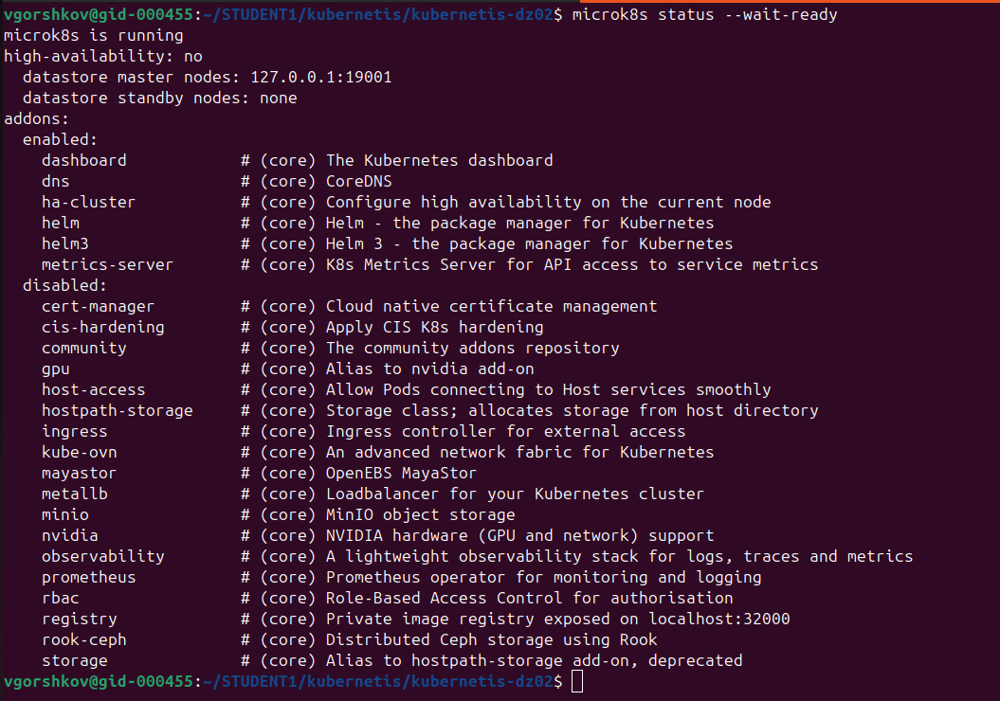

Запишем конфиг из MicroK8s
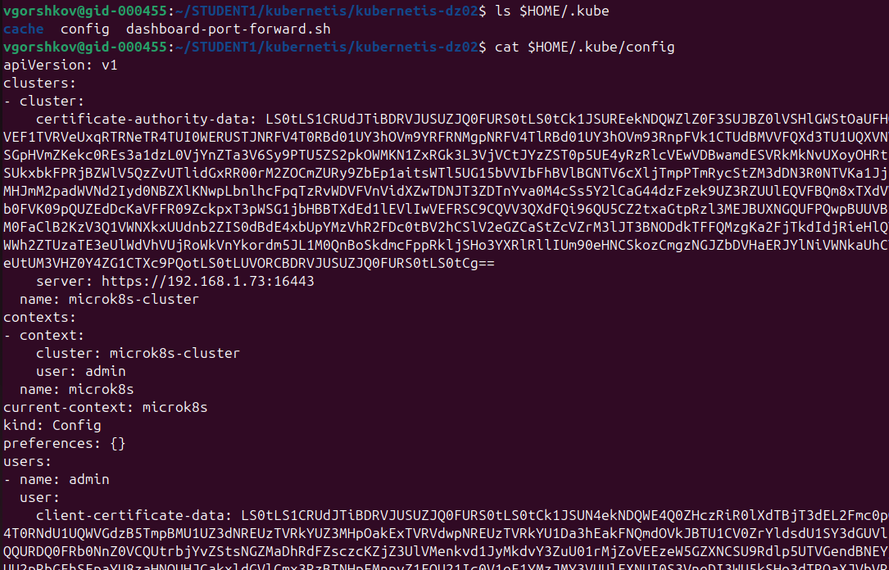

Проверяем или устанввливаем права
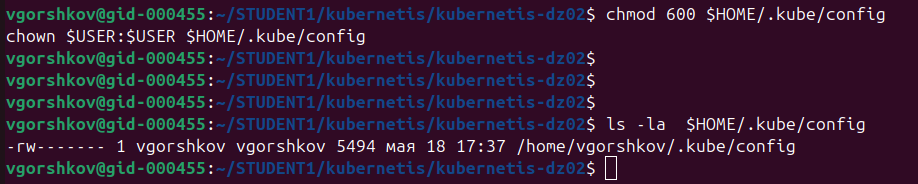

Проверим доступность нашего описанного кластера:
```
kubectl cluster-info
kubectl get nodes
kubectl get pods -A
```
Все отлично:
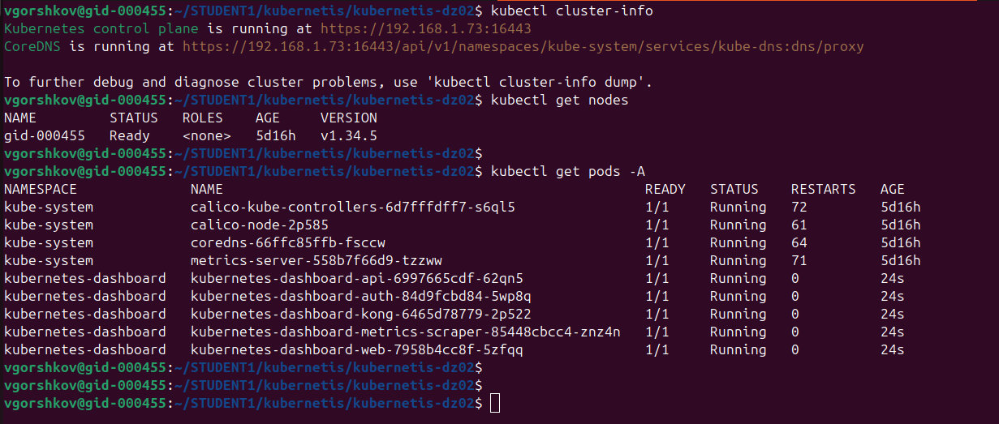


---=== Приступаем к практике ===---

Задание 1.
Создать Pod с именем hello-world
Создать манифест (yaml-конфигурацию) Pod: [text](hello-world-pod.yml)

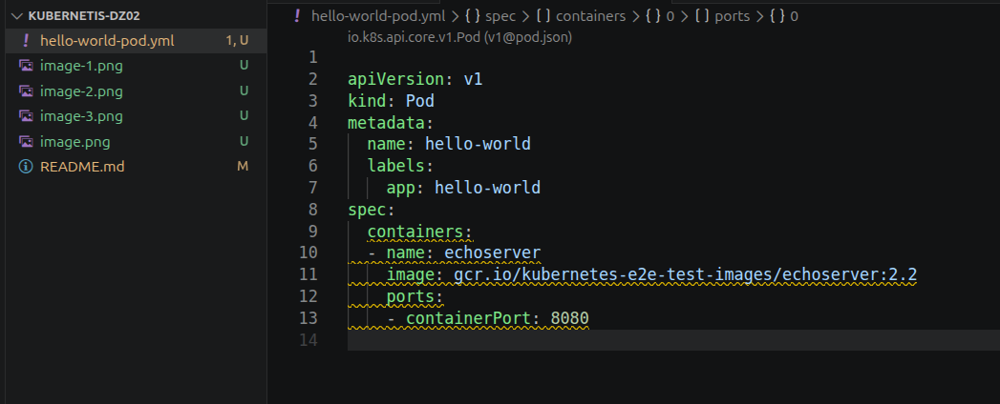

Использовать image - gcr.io/kubernetes-e2e-test-images/echoserver:2.2.

* указали в манифесте

Создаем pod
'''
kubectl apply -f hello-world-pod.yml
'''
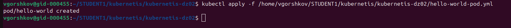

Проверяем pod
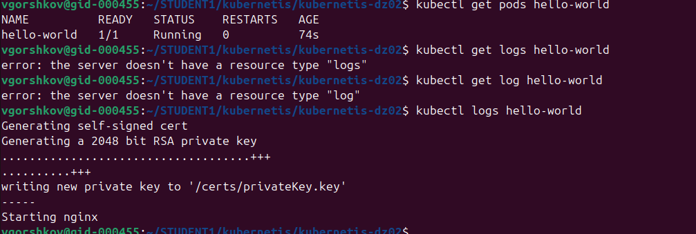


Подключиться локально к Pod с помощью kubectl port-forward и вывести значение (curl или в браузере).

Выполним настройку сети кубера для работы с подом через порт 8080
```
kubectl port-forward pod/hello-world 8080:8080
```
Здесь локальный порт 8080 пробрасывается напрямую на порт 8080 внутри контейнера.


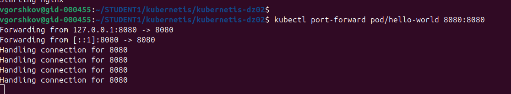

Проверяем подключением через браузер:
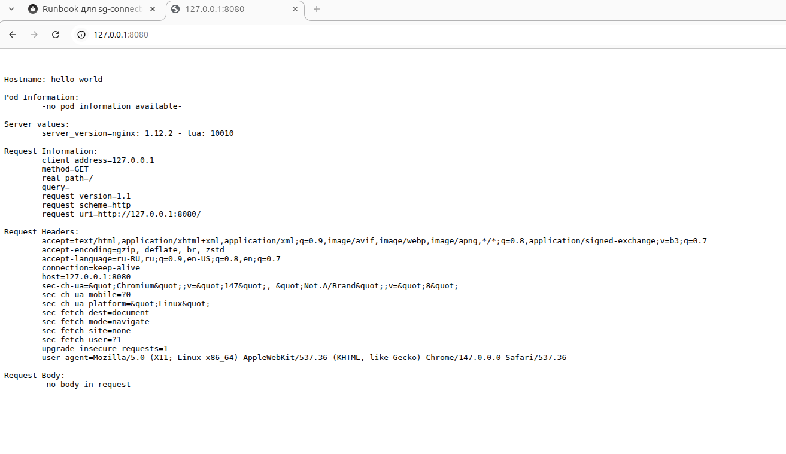

Проверяем подключением из терминала
```
curl --verbose --trace-ascii - http://127.0.0.1:8080/

```
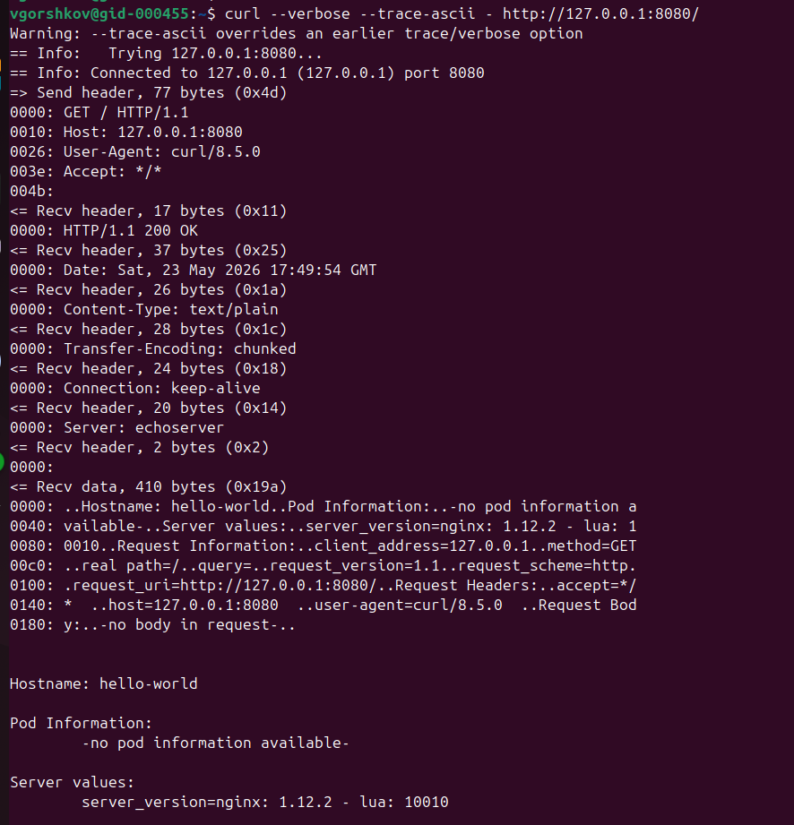
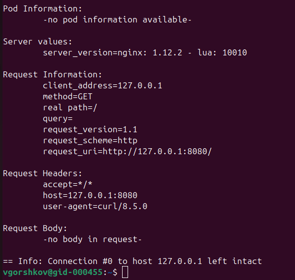

```
sudo tcpdump -i lo port 8080 -nn -X
```

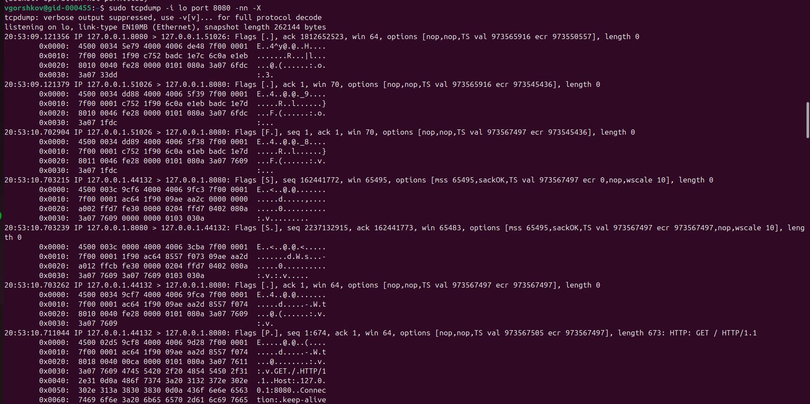


Задание 2. 
Создать Service и подключить его к Pod
Создали новый под и указали в нем метку
Манифест Pod: [text](netology-web.yaml)

Создать Pod с именем netology-web.
Использовать image — gcr.io/kubernetes-e2e-test-images/echoserver:2.2.

Создать Service с именем netology-svc и подключить к netology-web.
Подключиться локально к Service с помощью kubectl port-forward и вывести значение (curl или в браузере).
Создали манифест для сервиса и подключили его с помощью селектора к поду.
Манифест сервиса: [text](netology-svc.yaml)

Применяем оба манифеста:

```
kubectl apply -f netology-web.yaml
kubectl apply -f netology-svc.yaml
```
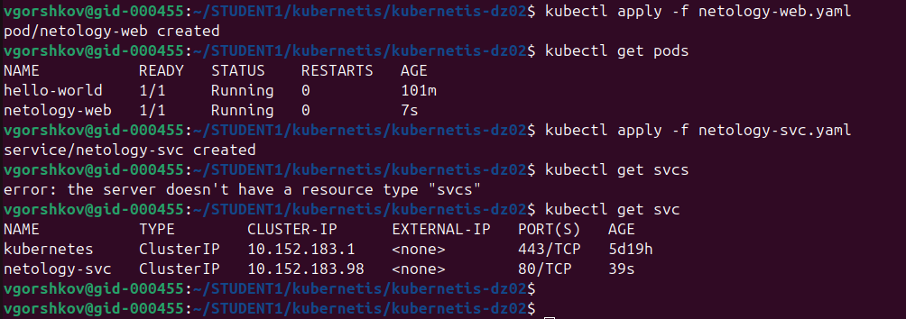

Внутри кластера подключение к поду идет через сервис, который на 80 порту, отправляет на 8080 порт пода.

Произведем публикацию локального порта 8081 внутрь кластера на сервис на порт 80.
```
kubectl port-forward svc/netology-svc 8081:80
```

Localhost:8081 ---> Service:80 ---> Pod:8080

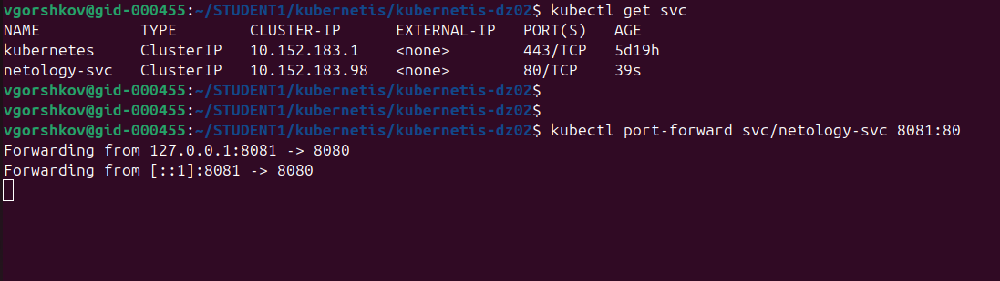

Проверяем подключение:

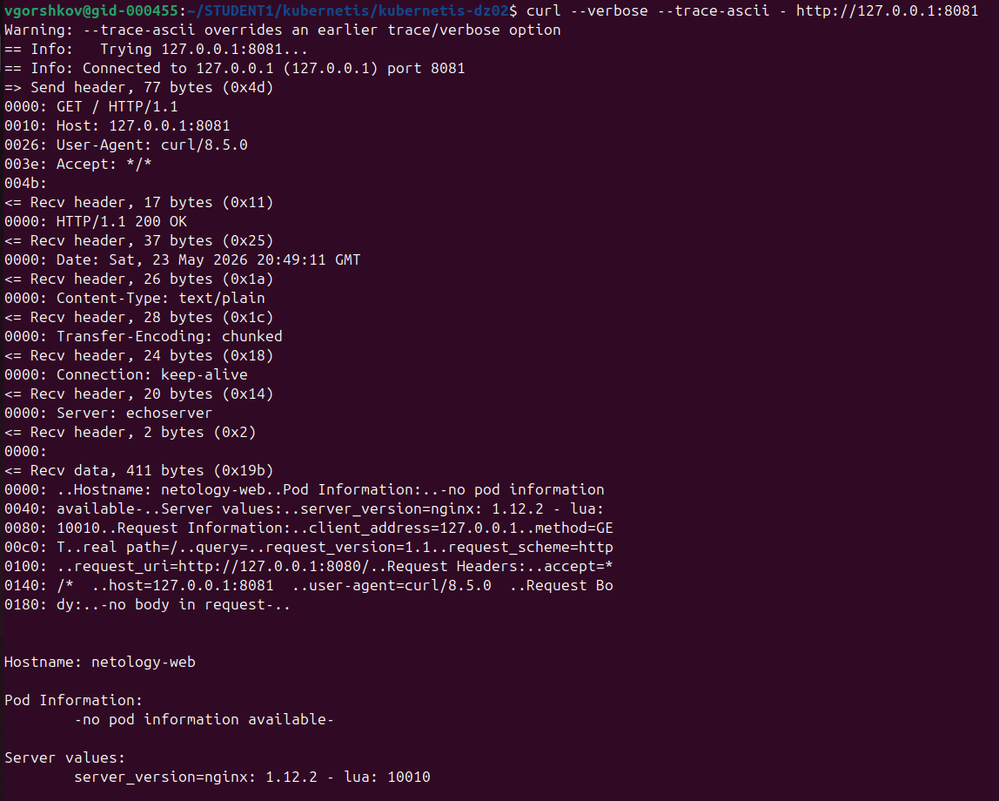
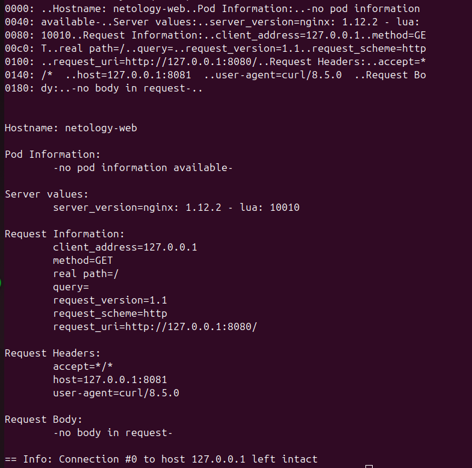

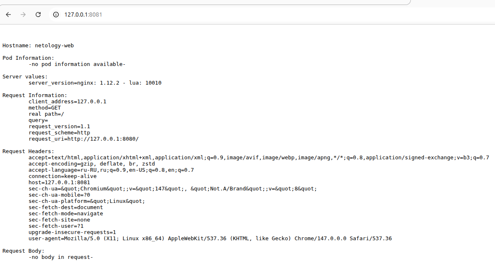

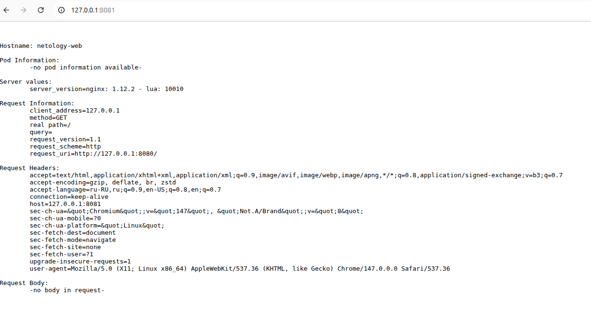

Спасибо, с уважением, Виктор
